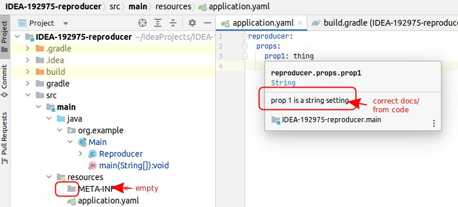

# IDEA-192975-reproducer

relates to issues:

* [IDEA-338397][IDEA-338397]
* [IDEA-192975][IDEA-192975]
* [IDEA-191886][IDEA-191886]

<!-- links -->

[IDEA-338397]: https://youtrack.jetbrains.com/issue/IDEA-338397
[IDEA-192975]: https://youtrack.jetbrains.com/issue/IDEA-192975
[IDEA-191886]: https://youtrack.jetbrains.com/issue/IDEA-191886

## steps to reproduce issue

1. open project in intellij (until it loads)
2. build it by running the `org.example.Main` class
3. open `application.yaml` in `src/main/resources`
    and see that the property is not detected:


4. then, fix the problem by moving and renaming file
    (IntelliJ forgot how to find this file, it used to know).

```shell
new=build/classes/java/main/META-INF/spring-configuration-metadata.json
# granted this is not the "old" location - but bear with me
old=src/main/resources/META-INF/additional-spring-configuration-metadata.json
mkdir -p $(dirname $old)
cp $new $old
```

btw the "old" location comes from this suggestion:


5. Having taken the suggestion from IntelliJ,
    now, we get the definitions.
    But they are not from the source code,
    where the comment reads "prop 1 is a string setting":


> [!TIP]
> New!

6. Discover not just [IDEA-192975][IDEA-192975]
    but also [IDEA-338397][IDEA-338397],
    where the suggested workaround is to make the setters return `void`,
    aka, not be fluent:

```diff
diff --git a/src/main/java/org/example/Main.java b/src/main/java/org/example/Main.java
index 1de7f56..6726ace 100644
--- a/src/main/java/org/example/Main.java
+++ b/src/main/java/org/example/Main.java
@@ -17,7 +17,6 @@ public class Main {
     }
     
     @Data
-    @Accessors(chain = true)
     @Component
     @ConfigurationProperties("reproducer.props")
     static class Reproducer {
```

and now it works again:


