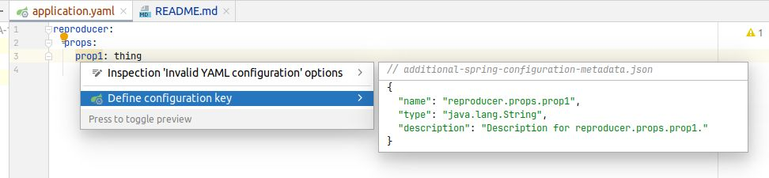

# IDEA-192975-reproducer

## steps to reproduce issue

1. open project in intellij (until it loads)
2. build it by running the `org.example.Main` class
3. open `application.yaml` in `src/main/resources`
    and see that the property is not detected:


4. then, fix the problem by moving and renaming file
    (IntelliJ forgot how to find this file, it used to know).

```shell
new=build/classes/java/main/META-INF/spring-configuration-metadata.json
# granted this is not the "old" location - but bear with me
old=src/main/resources/META-INF/additional-spring-configuration-metadata.json
cp $new $old
```

btw the "old" location comes from this suggestion:



5. Having taken the suggestion from IntelliJ,
    now, we get the definitions.
    But they are not from the source code,
    where the comment reads "prop 1 is a string setting":


